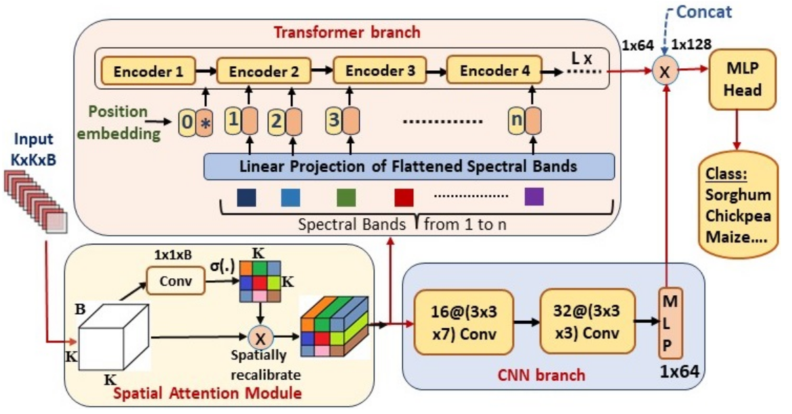

**UC-HSI:** **UAV-Based Crop HyperSpectral Imaging Datasets and Machine Learning Benchmark Results**

The code in this repository implements the "HyperConvFormer" model. 

The UAV-based Crop HyperSpectral imaging dataset will be made available here.

**Citation**

Please kindly cite this paper if this code is useful in your research.

1. Sankararao, Adduru UG, P. Rajalakshmi, and Sunita Choudhary "UC-HSI: UAV Based Crop Hyperspectral Imaging Datasets and Machine Learning Benchmark Results." IEEE Geoscience and Remote Sensing Letters (2024).
