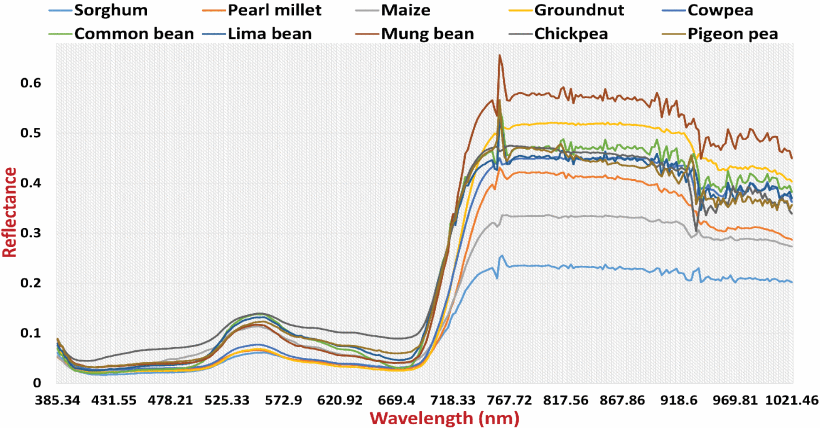

# Results Overview

This folder contains the key visualizations and results derived from the **UC-HSI datasets** and the **HyperConvFormer** model, as described in the paper  
**"UC-HSI: UAV-Based Crop Hyperspectral Imaging Datasets and Machine Learning Benchmark Results" (IEEE GRSL 2024).**

---

## Figures and Descriptions

### **Fig. 1: NIQE and Reflectance Comparison**
  
This figure compares **noisy vs. denoised HSI data** using NIQE score plots (top) and canopy spectra (bottom). Denoising (FastHyDe) improves spectral smoothness and reduces noise, especially at the spectrum boundaries.

### **Fig. 2: Crop Dataset Class Distribution**
  
Displays the distribution of HSI samples across **10 crop categories**. It shows the number of patch samples and images per class, ensuring balanced training and testing datasets.

### **Fig. 3: Representative Canopy Spectra**
  
Shows **spectral reflectance curves** of 10 crop types (cereals and legumes), captured in the 385–1021 nm range. Each curve highlights unique spectral signatures that distinguish crop varieties.

### **Fig. 4: Growth Stage Dataset Summary**
  
Highlights the dataset statistics for **sorghum and groundnut growth stages**, covering 5 key stages: vegetative, flowering initiation, peg/milk, grain filling, and maturity.

### **Fig. 5: Crop-Type Classification Results**
  
A table comparing **classification accuracy (OA, AA, Kappa)** of different ML and DL models (SVM, 3D CNN, ViT, SpectralFormer) on the crop category dataset.

### **Fig. 6: Growth Stage Classification Performance**
  
Shows benchmark results for **growth stage classification** of sorghum and groundnut datasets, comparing the performance of multiple baseline models.

### **Fig. 7: Overall Accuracy Comparison Across Models**
  
A bar chart illustrating the **overall accuracy (OA)** of HyperConvFormer vs. baseline models on crop category and growth stage datasets. HyperConvFormer consistently outperforms others.

---

## Reference
If you use these results, please cite:  
**Adduru U. G. Sankararao, P. Rajalakshmi, and Sunita Choudhary,  
"UC-HSI: UAV-Based Crop Hyperspectral Imaging Datasets and Machine Learning Benchmark Results," IEEE GRSL, 2024.**
